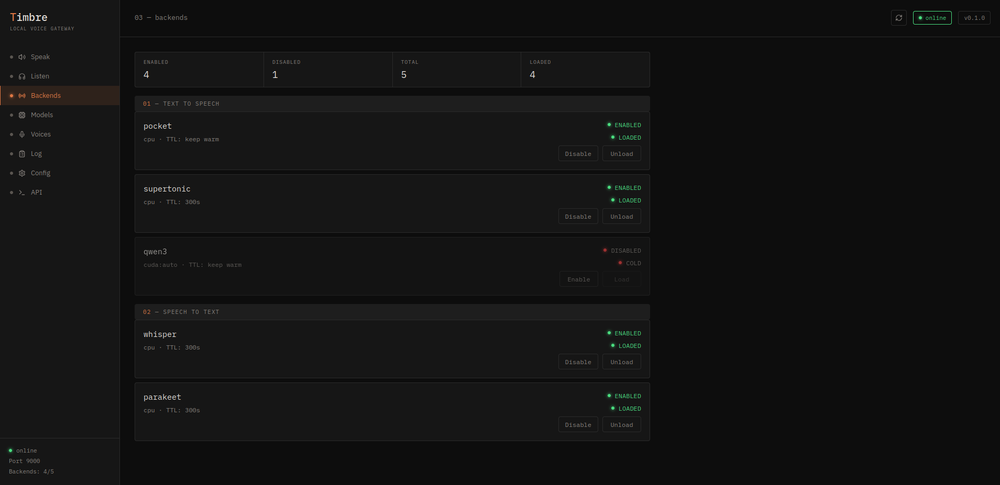

# Timbre

**One process. Every voice backend.**

Timbre is a local voice gateway that unifies your TTS and STT backends behind a single OpenAI-compatible API. Instead of managing separate containers for each service, Timbre imports backends as libraries and serves them from one process, with lazy model loading, automatic unloading, and a built-in management UI.



## Why Timbre?

Running local voice means juggling PocketTTS on one port, Whisper on another, Parakeet on a third, each in its own container with its own config. Timbre replaces all of that with one URL.

Point your agent, app, or tool at `http://localhost:9000/v1/audio/speech` and pick your backend with the `model` field. That's it.

### Benchmarks

Timbre vs the same backends running as standalone Docker containers. Same hardware, same input, Docker-to-Docker comparison.

| Backend | Task | Standalone | Timbre | Result |
|---------|------|-----------|--------|--------|
| PocketTTS | TTS | 2.63s | 0.95s | **64% faster** |
| Supertonic | TTS | 1.01s | 1.30s | +290ms |
| Parakeet | STT | 0.27s | 0.26s | **equal** |
| faster-whisper | STT | 3.48s | 2.32s | **33% faster** |

*Ryzen 9 5950X, CPU inference, 3.3s test audio.*

### Backends

**Text-to-Speech:** PocketTTS (fast, CPU), Supertonic (fast, ONNX), Qwen3 (quality, CUDA)

**Speech-to-Text:** Parakeet (fast, ONNX), faster-whisper (compatible, CTranslate2)

## Quick Start

### pip

```bash
python3.12 -m venv .venv && . .venv/bin/activate
pip install timbre-voice[all]
timbre setup
timbre serve
```

Server starts at `http://127.0.0.1:9000`. UI at `http://127.0.0.1:9000/ui/`.

### Docker

```bash
docker compose up -d --build
```

For Qwen3 / CUDA:

```bash
docker compose -f docker-compose.cuda.yml up -d --build
```

### Verify

```bash
curl http://127.0.0.1:9000/health
curl http://127.0.0.1:9000/v1/backends
```

## Usage

### Text-to-Speech

```bash
curl http://127.0.0.1:9000/v1/audio/speech \
  -H "content-type: application/json" \
  -d '{"model":"pocket","input":"Hello from Timbre.","voice":"alba"}' \
  --output speech.wav
```

Switch backends by changing `model`: `pocket`, `supertonic`, or `qwen3`.

Supported output formats: `wav`, `mp3`, `opus`, `ogg`, `flac`.

Qwen also works through this OpenAI-compatible route. Use a Qwen Studio clone name as `voice` for clone mode, or a Qwen preset voice for preset mode. Timbre defaults this route to the lighter `0.6b` Qwen profiles unless you pass `"model_size":"1.7b"`.

```bash
curl http://127.0.0.1:9000/v1/audio/speech \
  -H "content-type: application/json" \
  -d '{
    "model": "qwen3",
    "input": "This uses a saved Qwen clone through the OpenAI route.",
    "voice": "my_qwen_voice",
    "model_size": "0.6b"
  }' \
  --output qwen-openai-clone.wav
```

```bash
curl http://127.0.0.1:9000/v1/audio/speech \
  -H "content-type: application/json" \
  -d '{
    "model": "qwen3",
    "input": "This uses a Qwen preset speaker with an instruction.",
    "voice": "Vivian",
    "instructions": "Speak warmly with calm confidence.",
    "qwen_mode": "preset",
    "model_size": "0.6b"
  }' \
  --output qwen-openai-preset.wav
```

### Speech-to-Text

```bash
curl http://127.0.0.1:9000/v1/audio/transcriptions \
  -F model=parakeet \
  -F file=@recording.wav
```

Switch backends: `parakeet` or `whisper`.

### Voice Cloning

Upload a 5-10 second reference clip and use it by name:

```bash
curl http://127.0.0.1:9000/v1/voices \
  -F name=my_voice \
  -F backend=pocket \
  -F precompute=true \
  -F file=@reference.wav
```

```bash
curl http://127.0.0.1:9000/v1/audio/speech \
  -H "content-type: application/json" \
  -d '{"model":"pocket","input":"Speaking in a cloned voice.","voice":"my_voice"}' \
  --output cloned.wav
```

### Voice Aliases

Timbre maps OpenAI voice names to native backend voices, so existing clients work without changes:

```bash
curl http://127.0.0.1:9000/v1/audio/speech \
  -H "content-type: application/json" \
  -d '{"model":"supertonic","input":"Hello.","voice":"alloy"}' \
  --output hello.wav
```

`alloy` resolves to Supertonic's `F1`. Default aliases: alloy/F1, echo/M1, fable/M2, nova/F2, onyx/M3, shimmer/F3. Custom aliases can be created through the API or UI.

### Qwen Studio

Qwen has its own Studio tab and API because it has more than one workflow:

- **Clone:** use your own reference audio with Qwen Base.
- **Preset Voice:** use Qwen preset speakers with style/emotion instructions.
- **Voice Design:** describe a new voice in text, generate it, then save the exact generated audio as a clone.

Clone and Preset Voice can use `0.6b` or `1.7b` through `model_size`. Voice Design uses `1.7b`.
Timbre switches the active Qwen model automatically for these Studio endpoints, so you do not have to set the model manually before each request.

Upload a Qwen clone reference:

```bash
curl http://127.0.0.1:9000/v1/qwen/voices \
  -F name=my_qwen_voice \
  -F file=@reference.wav \
  -F ref_text='Text spoken in the reference audio.' \
  -F model_size=1.7b \
  -F prepare=false
```

Generate with that clone:

```bash
curl http://127.0.0.1:9000/v1/qwen/clone/speech \
  -H "content-type: application/json" \
  -d '{
    "input": "Speaking with a Qwen reference voice.",
    "voice": "my_qwen_voice",
    "model_size": "1.7b",
    "response_format": "wav",
    "language": "Auto"
  }' \
  --output qwen-clone.wav
```

Use a Qwen preset voice with instructions:

```bash
curl http://127.0.0.1:9000/v1/qwen/custom-voice/speech \
  -H "content-type: application/json" \
  -d '{
    "input": "This uses a Qwen preset speaker.",
    "speaker": "Vivian",
    "model_size": "1.7b",
    "instruct": "Speak warmly with calm confidence.",
    "response_format": "wav",
    "language": "Auto"
  }' \
  --output qwen-preset.wav
```

Design a voice:

```bash
curl http://127.0.0.1:9000/v1/qwen/voice-design/speech \
  -H "content-type: application/json" \
  -d '{
    "input": "This is a newly designed narrator voice.",
    "instruct": "A warm mature narrator, slow pacing, intimate microphone.",
    "model_size": "1.7b",
    "response_format": "wav",
    "language": "Auto"
  }' \
  --output qwen-design.wav
```

To save a Voice Design result as a reusable clone, upload the generated WAV:

```bash
curl http://127.0.0.1:9000/v1/qwen/voices \
  -F name=my_designed_voice \
  -F file=@qwen-design.wav \
  -F ref_text='This is a newly designed narrator voice.' \
  -F design='A warm mature narrator, slow pacing, intimate microphone.' \
  -F model_size=1.7b \
  -F prepare=false
```

## Features

**Lazy loading with TTL.** Models load on first request and unload after a configurable idle timeout. The server is always reachable; only model weights cycle in and out of memory.

**Backend management.** Enable, disable, load, and unload backends at runtime through the API or UI without restarting the server.

```bash
curl http://127.0.0.1:9000/v1/backends/tts/pocket \
  -H "content-type: application/json" \
  -d '{"action":"load"}'
```

**Server logs.** Timbre records server-side TTS/STT generation events, Qwen mode switches, errors, durations, input size, output size, backend, voice, model, and client. These events are printed to Docker logs and exposed to the UI Log page. Raw HTTP access logs are quiet by default; start with `timbre serve --access-log` if you want every request line.

```bash
curl http://127.0.0.1:9000/v1/logs
```

**Model profiles.** Download and switch between model variants per backend.

```bash
timbre download-models --model whisper:small --set-default
timbre download-models --model parakeet:int8 --set-default
```

**Config API.** View and update configuration at runtime.

```bash
curl http://127.0.0.1:9000/v1/config
curl -X PUT http://127.0.0.1:9000/v1/config \
  -H "content-type: application/json" \
  -d @config.json
```

## Qwen3 (Optional, CUDA)

Qwen3 is disabled by default. It requires a CUDA GPU and pulls heavy dependencies. Use the CUDA Docker compose file for the simplest setup.

```bash
pip install timbre-voice[qwen3]
timbre download-models --model qwen3:1.7b-customvoice --set-default
```

Available Qwen model profiles:

- `qwen3:0.6b-base`
- `qwen3:0.6b-customvoice`
- `qwen3:1.7b-base`
- `qwen3:1.7b-customvoice`
- `qwen3:1.7b-voicedesign`

You can also use Qwen through the generic OpenAI-compatible speech route. Timbre automatically switches between the Qwen Base profile for saved clone voices and the Qwen CustomVoice profile for preset voices:

```bash
curl http://127.0.0.1:9000/v1/audio/speech \
  -H "content-type: application/json" \
  -d '{"model":"qwen3","input":"Hello from Qwen.","voice":"Vivian","model_size":"0.6b"}' \
  --output qwen.wav
```

For multi-GPU systems, set the device to `cuda:auto` (picks the GPU with most free VRAM), or pin a specific GPU with `cuda:0`, `cuda:1`, etc. In Docker, you can also limit the visible GPU with `TIMBRE_NVIDIA_VISIBLE_DEVICES` in `.env` before starting `docker-compose.cuda.yml`.

For best throughput, install Flash Attention:

```bash
pip install flash-attn --no-build-isolation
```

CUDA Docker handles this automatically.

## Configuration

Config lives at `~/.config/timbre/config.yaml`. Edit it directly, through the UI Config page, or through the API. Changes to backends, TTL, and device settings apply immediately. Host/port changes require a restart.

## Development

```bash
git clone https://github.com/Spadav/Timbre.git
cd Timbre
python3.12 -m venv .venv && . .venv/bin/activate
pip install -e ".[all,dev]"
cd web && npm install && npm run build && cd ..
timbre serve
```

Run tests:

```bash
ruff check .
pytest -q
```

## Architecture

Timbre is not a wrapper around existing audio servers. Each backend is imported as a Python library and called directly. The API surface, routing, TTL management, voice system, and UI are all original code. The backends are dependencies, like numpy or torch.

```
Request -> FastAPI Router -> Backend Manager -> Backend ABC -> Library Call
                                  |
                            TTL Manager (load/unload weights)
```

Adding a new backend means implementing a simple ABC (TTSBackend or STTBackend) and registering it. The router and API never change.

## License

Timbre's source code is MIT licensed. Backend model weights are subject to their
own licenses (see each backend's documentation).

## Links

- GitHub: [Spadav/Timbre](https://github.com/Spadav/Timbre)
- PyPI: [timbre-voice](https://pypi.org/project/timbre-voice/)
- Docker Hub: [spadav/timbre](https://hub.docker.com/r/spadav/timbre)
